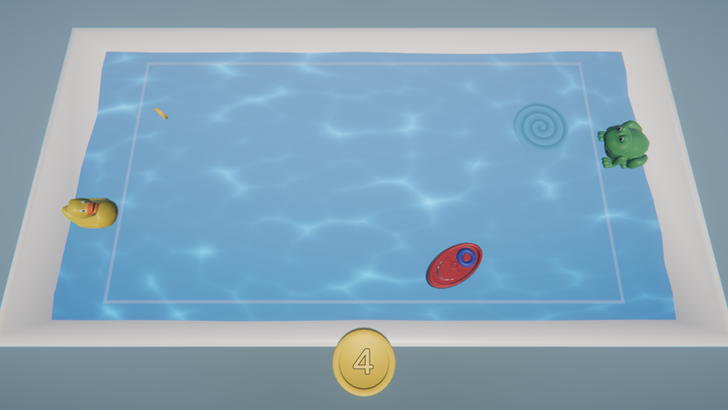

# Splash It!

<p align="center"></p>

## About

Splash It! is a **local co-op arcade** game made in **~48h** during [Mini Jam 48: Teamwork](https://itch.io/jam/mini-jam-48-teamwork). The main goal is to **collect** as many **coins** as you can by moving **the boat** in the bathtub. The players **control** two characters, the duck on the left and the frog on the right. A character can **move** up and down, as well as **jump** to make **a splash**. The wave caused by jumping **moves** the boat. The players have to avoid the whirl that **spawns** in the different parts of the bathtub. The game ends when the boat **gets sucked into** the whirl.

You can **play in the browser** or **download for Windows** by clicking [here](https://m-biernat.itch.io/splash-it).

## Tools & Dependencies

 - [Unity 2019.2.12](https://unity.com/releases/editor/whats-new/2019.2.12) - game engine;
 - [Blender 2.81](https://www.blender.org/download/releases/2-81/) - to create 3D models.

*The project requires Blender installed because of ```.blend``` files.*

## Credits

 - **Michał Biernat** @[m-biernat](https://github.com/m-biernat) - game designer, programmer;
 - **Anna Hosumbek** @[An-Hos](https://github.com/An-Hos) - 3D artist.

BGM and SFX are from [Freesound.org](https://freesound.org/), licensed under [CC0](https://creativecommons.org/publicdomain/zero/1.0/).

## License

All rights reserved ([no license](https://choosealicense.com/no-permission/)): 
 - You **can** view (peek into the code and assets) and fork this repository;
 - You **cannot** reproduce, distribute, or create derivative works;
 - You **can** play the game (*"Splash It!"*) free of charge via the provided channels.
